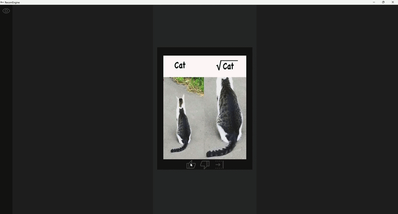
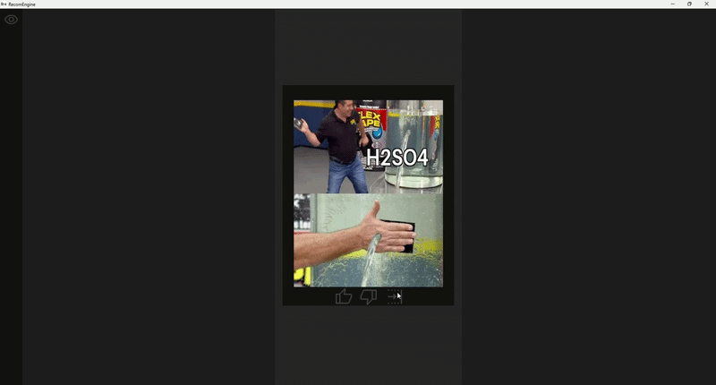
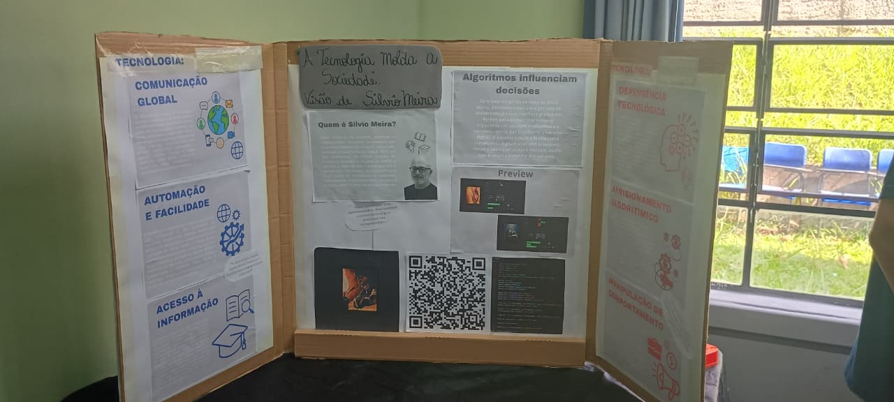

# RecomEngine

O RecomEngine é um Software feito totalmente em Python que simula um algoritmo de recomendação. O projeto aborda o algoritmo de recomendação de forma mais simples, simulando atráves de uma interface gráfica uma plataforma no estilo de vídeos curtos, mostrando o feed com imagens que o usuário pode interagir e a parte por trás de todo algoritmo, através de gráficos mostramos como o algoritmo manipula as interações do usuário para mostrar conteúdos condizentes aos gostos do usuário, os conteúdos são imagens, com diferentes tipos. O sistema é totalmente mecânico pelo fato de ser um simulador, abordamos algo mais mecânico diferentemente dos algoritmos atuais que usam IA para manipular as informações.

O objetivo do projeto é demonstrar como o algoritmo de recomendação pode influênciar e prender o usuário. para facilitar esse entendimento o proprio sistema mostra através de gráficos:

- Os interesses identificados com base nas interações do usuário;
- A quantidade de interações realizadas;
- O processo de distribuição dos conteúdos pelo algoritmo.

Além disso o projeto conta com um sistema de [anúncios](imagens/anuncios/) que altera automaticamente a publicidade exibida de acordo com as interações do usuário. A base de mídia utilizada é composta por 107 imagens sendo 100 para o feed e 7 representando cada tema utilizado pelo algoritmo.

## Preview
Feed: 

Graficos: 

## Estrutura

O RecomEngine possui uma estrutura bem simples. A estrutura do projeto conta com uma pasta [imagens](imagens) que guarda todas as imagens utilizadas ao decorrer do projeto sendo elas os [anuncios](imagens/anuncios/), [icones](imagens/icones/), [preview](imagens/preview/) e [tipos](/imagens/Tipos/), voltando a pasta mãe encontramos o arquivo [main.py](main.py) que é o código do projeto, e por fim encontramos o aquivo do [pre-projeto](pre-projeto.docx) feito no word que mostra o projeto inicial com a primeira ideia que construimos para chegar a este projeto.

- [imagens](imagens)
    - [anuncios](imagens/anuncios/)
    - [icones](imagens/icones/)
    - [preview](imagens/preview/)
    - [tipos](/imagens/Tipos/)
- [main.py](main.py)
- [pre-projeto](pre-projeto.docx)

## Como executar o projeto

1. Clone o repositório https://github.com/uellpng-tech/recomengine.git

2. Acesse a pasta do projeto "recomengine"

3. Crie um ambiente virtual python3 -m venv venv (opcional)

4. Ative o ambiente virtual "venv\Scripts\activate"

5. Instale as dependências "pip install -r requirements.txt"

6. Execute o programa "python main.py"

## Paulo Freire

A iniciativa do evento é influênciar a busca por educação e trazer o reconhecimento a profissionais e estudiosos importantes. O evento inicialmente introduz aos estudantes uma atividade com regras especificas, partindo desse ponto os grupos montados para seguir a ideia sem sair da regra deve criar um projeto com base na quilo. 

Paulo Freire foi um educador e filósofo brasileiro, reconhecido mundialmente. Além do conceito inicial a intenção do projeto é influênciar também a visibilidade de estudiosos e profissionais brasileiros, Paulo Freire foi um dos Patronos da educação no Brasil, ele revolucionou a alfabetização de adultos criando métodos baseados na realidade dos alunos, além disso possuiu muitos outros feitos, assim sendo um marco para sociedade como um todo. A intenção desse evento também é mostrar quem foi Paulo Freire.

## Silvio Meira

Silvio Romero de Lemos Meira é um cientista, professor e emprendedor brasileiro com atuação  na área de engenharia de software e inovação. Silvio Meira é um estudioso muito importante na área da tecnologia, atualmente Silvio Meira é associado da Escola de Direito do Rio de janeiro da FGV e professor emérito do Centro de Informática da UFPE. Pela sua influência na área da tecnologia nosso projeto resolveu abordar através da visão dele o conceito de tecnologia 

## Contexto

O conceito do projeto parte do pensamento de Silvio Meira. A intuição do projeto foi a conclusão de um trabalho para um evento anual "Paulo Freire", o projeto foi destinado a apresentar o ponto de vista de Silvio Meira perante a tecnologia, Silvio Meira parte do conceito de que a tecnologia é uma arma ambigua e pode ser usada tanto para o bem quanto para o mal, por tanto em conjunto a esse pensamento o grupo responsável pelo projeto decidiu apresentar um simulador de algoritmo, partindo da ideia principal de Silvio Meira.

### Cartaz: 
 

### Pré-Projeto

[Pré-Projeto Paulo Freire](pre-projeto.docx)

### Contribuidores

- Arthur Barbosa De Sousa 
- Arthur Enrick Da Cruz 
- Caio Mendonça Souza 
- Emanuell Honorio de Souza
- Gustavo Mendes Machado